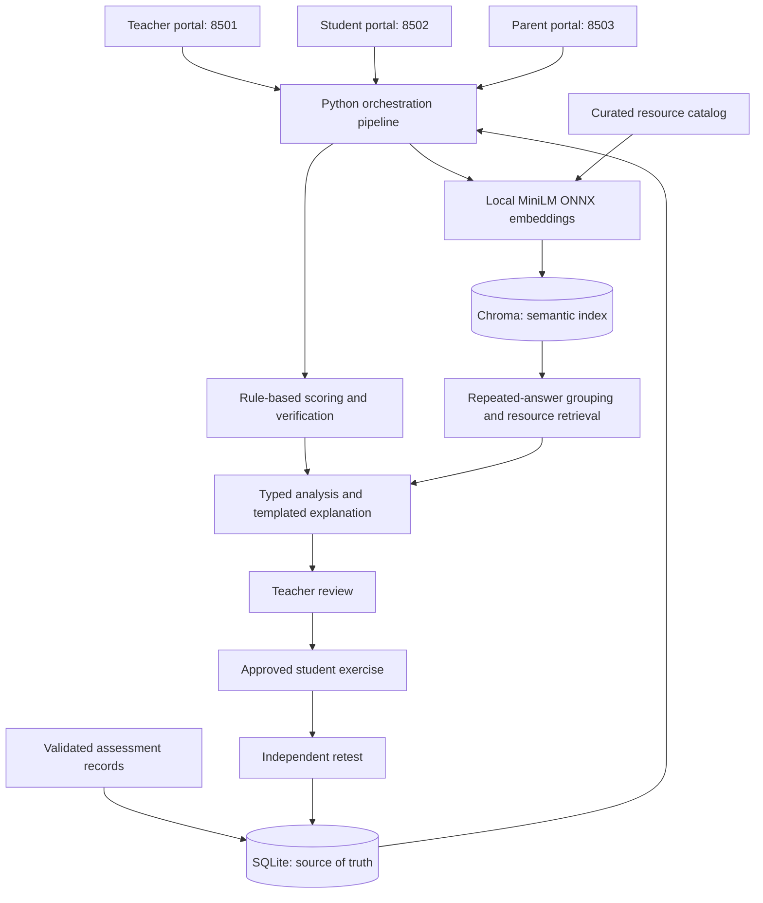

# GapTrace: project overview

This document describes the implementation currently in this workspace, checked against the source on 20 September 2026.

## What the project does

GapTrace is a local learning-support pilot. It compares a learner's performance with assistance against their performance without assistance across comparable assessment checkpoints. It identifies whether that gap is widening, narrowing, stable, inconsistent, or unsupported by enough evidence. Teachers review the evidence and decide whether to share a curated practice exercise.

The application is a working local prototype with three portals, persistent storage, real semantic retrieval, follow-up assessments, and an optional MCP interface. It is not a validated diagnostic system. The demonstration history is synthetic.

**The key technical distinction:** real AI inference is used to create text embeddings. There is no generative LLM call in the GapTrace application pipeline. Scoring, evidence verification, explanation text, parent-question routing, and quiz grading are deterministic. The current retrieval flow is best described as semantic retrieval with curated recommendations and templated explanations, rather than full LLM-powered retrieval-augmented generation (RAG).

## What has been implemented

| Area | Implemented behavior |
|---|---|
| Teacher portal | Student/skill selection, actual matched-history preview, analysis, paired-performance chart, gap and hint charts, evidence review, learning signals, practice suggestions, downloadable summary, cohort overview, and check-in queue. |
| Teacher decisions | Intervene shares reviewed practice; Monitor retains the pattern without releasing a practice plan; Dismiss suppresses suggestions until the decision changes. |
| Student portal | Request practice, view a teacher-approved exercise, request an alternative that excludes already-shown resources, ask for a conversation, and submit an independent retest. |
| Parent portal | Resolve the learner through a parent-account link, view a supportive update, and ask questions through one text field. Responses use restricted templates and optional resource lookup. |
| Assessment ingestion | Validate records with Pydantic, reject unknown skills, preserve consecutive attempt versions, reject conflicting rewrites, and commit batches atomically. |
| Analysis | Match comparable assisted/independent work, calculate trends, check evidence quality, group repeated incorrect answers, retrieve practice, and save the analysis. |
| Knowledge retrieval | Real local ONNX embeddings, persistent Chroma collections, cosine similarity, student/skill filtering for response searches, and minimum similarity thresholds. |
| Follow-up | Three fixed questions per skill, answer-key grading, persisted independent attempts, confidence capture, and a descriptive before/after independent result. |
| Learning signals | Hint dependency, retention change, error-pattern diversity, repeated-error ratio, confidence calibration, and related-skill co-movement. |
| Integration | Six FastMCP tools expose the same analysis functions. Execution can be local Python calls or an explicitly configured MCP connection. |
| User interface | Shared local font, light green visual system, responsive desktop/tablet/mobile layouts, accessible native controls, and clear empty/loading/error states. |
| Verification | Unit, integration, portal, retrieval, persistence, and cross-process tests; preserved starter-file checks; browser inspection. |

The synthetic seed dataset contains 1,200 attempts across 108 learners. The supported taxonomy has four skills: Python loop boundaries, Python iteration/accumulation, fractions, and ratios. These are demonstration scenarios, not real student research results.

## Architecture



SQLite and Chroma have different jobs:

- **SQLite is the authoritative record store.** It persists versioned attempts, teacher decisions, parent links, analysis snapshots, and separate check-in requests.
- **Chroma is a search index.** It stores embedded response text and embedded resource descriptions. It does not replace the authoritative assessment records.

The launcher runs a single Chroma service at `127.0.0.1:8504`, shared by the three portal processes. This avoids stale embedded indexes when one portal writes new data and another queries it. A data-directory descriptor and per-start instance token identify the correct service. This token prevents accidental connection to a stale or different store; it is not user authentication. Isolated scripts/tests can still use embedded Chroma when no shared-service descriptor exists.

## The analysis pipeline, step by step

### Collect and validate evidence

Each attempt includes a learner, skill, task, matched task set, checkpoint, timestamp, assistance condition, response text, correctness, hint count, rubric version, origin, and version number. The ingestion function validates these fields and the configured skill taxonomy before storing them.

An existing attempt can receive a new consecutive version, but cannot silently change its learner, skill, task identity, assessment condition, or origin. Analysis normally uses the latest version; historical version IDs remain available for traceability.

### Compare equivalent assessment conditions

The scorer pairs attempts only when they share the same checkpoint, matched task set, and rubric version. Unpaired work is excluded from the assisted/independent gap calculation.

For a checkpoint:

```text
learning gap = assisted correctness - independent correctness
```

For example, 90% assisted and 50% independent gives a gap of 40 percentage points. A large gap alone is not proof of skill erosion or its cause.

Classification uses a 0.03 score-difference tolerance, equivalent to three percentage points:

- Fewer than two matched checkpoints: insufficient data.
- All adjacent gap changes within the tolerance: stable.
- More than half the adjacent changes increase beyond the tolerance, with a positive net change beyond it: widening.
- The corresponding decreasing pattern: narrowing.
- Otherwise: contradictory.

These are explicit Python rules, not a trained predictive model.

### Verify evidence quality

A second rule-based function checks whether the history has at least three matched checkpoints, spans at least fourteen days, and avoids contradictory or insufficient evidence. It returns confirmed/downgraded status, a high/medium/low evidence rating, and reasons.

The rating is a heuristic evidence label, not a calibrated probability produced by an AI model.

### Group repeated independent mistakes

The system embeds the selected learner's response text and searches for semantically similar responses. Candidate mistakes must be independent attempts with correctness below 0.60 and nonempty text.

Grouping requires at least two responses. Every pair admitted to a group must meet a cosine-similarity threshold of 0.60. Searches are restricted to the same learner and skill, and to independent responses. Historical vectors can remain stored, but grouping is constructed from the latest candidate attempts.

This identifies repeated answer patterns. It does not use an LLM to diagnose a student's understanding. A cluster's description comes from a matching resource title/description when available, or from a short response-based fallback label.

### Retrieve a practice resource

The cluster description becomes a semantic search query against the resource collection. The top eligible result must meet a similarity threshold of 0.35. The system then copies the stored teacher summary and student exercise from that resource.

If no resource meets the threshold, the result explicitly says no matching resource. If a student requests another exercise, previous resource IDs are excluded. Similarity thresholds are pilot heuristics, not validated educational cutoffs or probabilities.

### Explain, review, and follow up

The explanation function inserts the trend and evidence into fixed supportive text. The teacher reviews the result and saves a decision. Only an Intervene decision makes the practice plan available through the student's practice flow.

The retest uses three predefined multiple-choice questions and a fixed answer key. It stores three new independent attempts and reports independent-score change. It does not invent an assisted result or calculate a new paired gap from an independent-only retest.

## How the knowledge base works

The curated knowledge base is `resources/remediation/catalog.json`, with eight resources: two for each supported skill. Each entry has a resource ID, title, description, teacher summary, student exercise, and a path to an accompanying Markdown file.

The application uses two content collections:

| Collection | Embedded text | Other stored information |
|---|---|---|
| `skill-erosion-attempts` | The learner's response text | Learner ID, skill ID, assistance condition, correctness, version, and a versioned evidence ID. |
| `skill-erosion-resources` | Resource title plus description | The serialized resource payload, including the curated exercise, teacher summary, ID, and Markdown path. |

There is also an empty service-identity collection used only to verify the local service connection.

**The Markdown files are not currently parsed or chunked into the vector index.** The search representation comes from the catalog's title and description. The response uses the catalog's stored exercise and summary. There is no PDF ingestion, document-upload workflow, crawler, or automatic knowledge-base expansion.

Resource indexing is checked when the analysis runs. Byte-identical entries are skipped; changed catalog entries are upserted. Assessment embeddings are created on demand for analyzed learner/skill histories, so loading 1,200 SQLite records does not immediately create 1,200 vectors. This is a small catalog-upsert mechanism, not a complete content-management system or deletion-synchronization workflow.

Resources are retrieved by semantic similarity across the catalog. There is no hard resource skill filter, separate reranker, or hybrid keyword/vector retrieval stage. Teacher review remains part of the recommendation flow.

## What AI inference is actually running?

| Component | Current implementation | Generative LLM? |
|---|---|---|
| Text embeddings | Chroma's real `all-MiniLM-L6-v2` ONNX embedding function | No; this is a learned text-embedding model. |
| Vector search | Cosine-distance retrieval in Chroma | No. |
| Mistake grouping | Deterministic grouping over embedding similarity | No. |
| Trend classification | Arithmetic and fixed thresholds | No. |
| Evidence verification | Checkpoint/time-span consistency rules | No. |
| Practice recommendation | Retrieve and return a curated resource | No. |
| Explanation | Fixed text populated with evidence | No. |
| Parent questions | Keyword intent routing, optional resource search, restricted templates, and output filtering | No. |
| Retest grading | Compare selections against fixed correct answers | No. |

The embedding model converts text into numerical representations so similar wording or meaning can be compared. The first use downloads the model; subsequent inference runs locally from its cache. The model is pretrained and is not trained or fine-tuned on the synthetic student dataset.

The embedding model does not decide whether an answer is correct. Correctness is already part of ingested assessment records, while built-in retests are graded against their answer keys. There is no arbitrary code execution or general AI grading in the GapTrace workflow.

The codebase calls its modular functions agents, but they run in a fixed orchestrated sequence. They are not autonomous LLM agents deciding which tools to call.

## Is this RAG?

It implements the retrieval portion of a RAG-style system:

```text
Response text -> local embeddings -> similar mistakes -> resource retrieval
             -> curated exercise and templated explanation -> teacher review
```

A full generative RAG pipeline would additionally pass retrieved source content and scoped evidence to a language model, then validate its generated answer and source references. That generation step is not implemented here.

Parent support questions may trigger resource retrieval, but the reply only adds that a relevant resource is available for teacher review. It does not synthesize an answer from the full Markdown documents.

**Adding an API key alone will not enable generative AI.** GapTrace currently has no LLM provider client, generation prompt, or provider-selection setting in its application pipeline. Any provider-related code or tests in the preserved starter project are separate from these GapTrace flows.

## MCP integration

The optional FastMCP server exposes exactly six application tools:

1. `collect_traces`
2. `score_divergence`
3. `verify_flag`
4. `cluster_misconceptions`
5. `recommend_remediation`
6. `explain_flag`

They call the same functions as local execution and exchange validated structured data. Set `SKILL_EROSION_MCP_URL` to the running MCP endpoint to use the remote adapters. The MCP server defaults to `127.0.0.1:8000/mcp` and is started separately. MCP provides a tool interface; its presence does not itself introduce LLM inference.

## Example journey

A learner repeatedly treats the upper endpoint of Python's `range` as included. Their supported scores stay high, while comparable independent results decline across several checkpoints.

1. The rules classify a widening assisted/independent gap.
2. Verification checks the quantity and time span of the evidence.
3. MiniLM embeddings help group repeated similar incorrect responses.
4. Resource search can select a loop-boundary exercise such as "See where range stops."
5. The teacher reviews the supporting attempts and chooses Intervene.
6. The student receives the stored exercise, such as writing out `range(2, 6)` and explaining the excluded endpoint.
7. A later independent retest records fresh evidence for review.

This is an illustrative path supported by the implemented components. An actual resource choice depends on the response text and retrieval scores.

## Current boundaries

- The demo covers four skills and a small curated resource catalog.
- The seed data is synthetic; no educational-effectiveness claim has been validated.
- Account selectors simulate roles. Parent-link checks enforce scope within application calls, but authenticated sign-in and production access controls are not implemented.
- Parent questions use limited keyword/template behavior rather than general conversation understanding.
- There is no generative LLM, general document ingestion/chunking, arbitrary-answer AI grading, or model-training pipeline.
- The application runs locally. Public hosting, production identity, and institutional-system integrations have not been implemented.

## What adding full generative RAG would require

This is future work, not existing functionality:

1. Add a server-side LLM provider adapter and explicit model/API-key configuration.
2. Parse approved documents into source-linked chunks and index their actual content.
3. Retrieve scoped evidence and relevant chunks, with skill filtering and a bounded context size.
4. Prompt the model to explain only the supplied evidence and reference retrieved sources.
5. Validate structured outputs, filter sensitive parent-facing content, and retain teacher approval.
6. Evaluate retrieval relevance, answer grounding, refusal on missing evidence, cross-account isolation, latency, and cost.

Trend calculation and deterministic quiz grading can remain unchanged while a generative layer improves explanations.

## Where to find the implementation

| Path | Responsibility |
|---|---|
| `apps/teacher_dashboard/app.py` | Teacher interface and decision controls |
| `apps/student_portal/app.py` | Practice, alternative exercise, support request, retest |
| `apps/parent_portal/app.py` | Linked-account update and question interface |
| `src/skill_erosion/ui.py` and `assets/theme.css` | Shared presentation, charts, typography, responsive styling |
| `src/skill_erosion/orchestration/pipeline.py` | Local/MCP execution sequence and teacher gates |
| `src/skill_erosion/agents/` | The seven analysis/support modules |
| `src/skill_erosion/embeddings/local.py` | Local embedding-model adapter |
| `src/skill_erosion/embeddings/chroma.py` | Indexing, metadata filters, vector retrieval |
| `src/skill_erosion/embeddings/service.py` | Shared local Chroma service lifecycle |
| `src/skill_erosion/storage/sqlite_repo.py` | Persistent records, versions, decisions, links and check-ins |
| `src/skill_erosion/contracts/models.py` | Typed data contracts and validation |
| `src/skill_erosion/assessments.py` | Fixed retest questions and grading |
| `src/skill_erosion/metrics.py` | Descriptive learning signals |
| `resources/remediation/catalog.json` | Curated searchable knowledge base |
| `src/skill_erosion/mcp_server.py` | Six MCP tools |
| `scripts/run_apps.py` | Start the three portals and shared search service |
| `docs/verification/ui-refinement.md` | Latest interface and regression verification report |

The latest recorded full regression run reported **106 passed, 3 skipped, and 10 subtests passed**. The skips belong to inherited external-provider tests requiring credentials. The final portal interaction test was also rerun successfully. These are implementation checks, not validation of educational outcomes.
